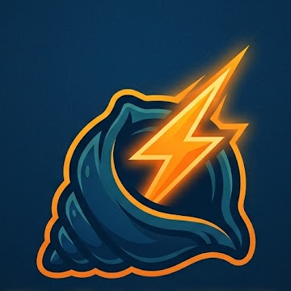
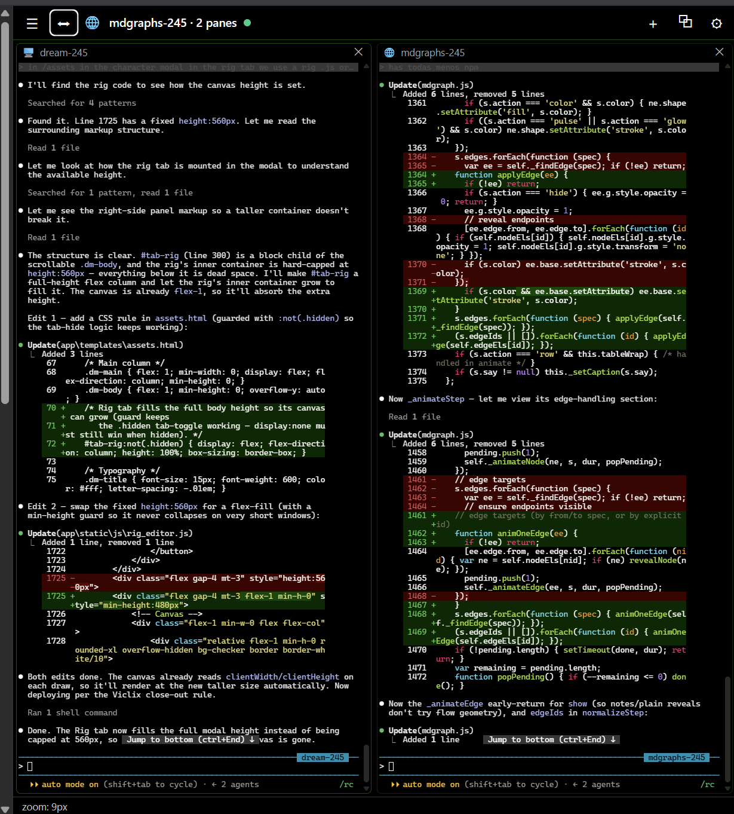
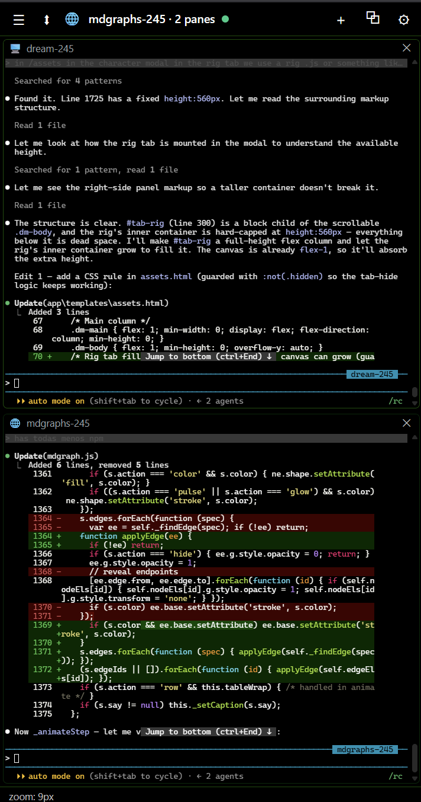
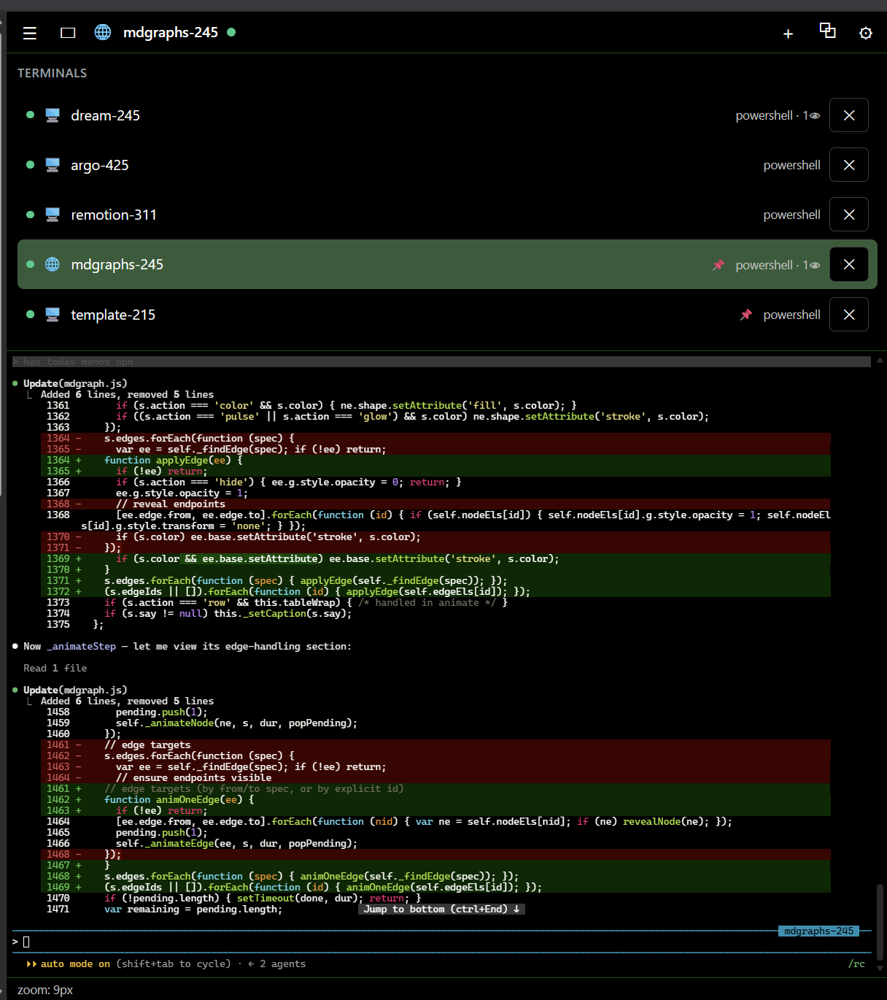

<div align="center">



# Power Shell(ed)

### Persistent PowerShell terminals, docked in Chrome's side panel — purpose‑built for [Claude Code](https://claude.com/claude-code).

Run your shells **next to the page you're working on**. Split them into grids, resize the dividers, zoom each one, and spin up a ready‑to‑go `claude` session in any project folder with two clicks.


</div>

---

<div align="center">

</div>

---

## Why

Alt‑tabbing between the browser and a terminal breaks flow — especially when you're driving **Claude Code** and want to watch it work while you read docs, a PR, or the running app. Power Shell(ed) puts real, **persistent** PowerShell terminals right in Chrome's side panel:

- The shells live in a tiny local server, so they **survive** closing the browser — reattach and your scrollback is still there.
- Terminals are **per‑tab** (like the Claude extension): open one on a tab, it stays there; switch tabs and it steps aside; come back and it's exactly as you left it.
- One tab can hold **up to 6 terminals at once** in resizable, ergonomic layouts.
- The **New terminal** form can scaffold a `claude` command for any project folder — model + remote control + a collision‑free session name — so you're one click from a live agent in the right directory.
- Sessions **survive a server restart** — the server snapshots every open shell and, on boot, resumes each one's exact Claude Code conversation while the panes reconnect on their own.
- Claude Code running in a pane can **drive the web page docked next to it** — read, click, type, screenshot, navigate — through a local MCP server, with each terminal locked to its own tab.

## Features

- 🗂️ **Per‑tab terminals** — each browser tab owns its own set of shells; a colored **tab group** marks which tabs have them, even when the panel is closed. The pill shows the session's **emoji + name** (abbreviated when a tab holds several).
- 🔲 **Multi‑pane, up to 6** — 1 full · 2 split · 3 with master layouts (one big + two stacked) · 4–6 auto grid.
- ↔️ **Draggable dividers** — drag any gutter to rebalance; sizes are remembered per layout, per tab.
- 🔍 **Per‑pane zoom** — `Ctrl` `+`/`-`, `Ctrl 0` to reset, or `Ctrl`+scroll. Each session remembers its own font size.
- 📁 **Cascading folder picker** — pick a **workspace**, then drill into any subfolder to set the working directory. Your workspaces are **yours** — add them in settings, nothing is hardcoded.
- ⭐ **Folder favorites** — star any folder (at any depth) in the picker to jump straight back to it next time, no re‑navigating.
- 🤖 **Claude Code launcher** — choosing a folder auto‑fills a run‑on‑start command:
  `claude --model claude-opus-4-8 --remote-control <folder>-<random>`, with a collision‑free Remote Control name.
- ⟳ **Resume past conversations** — the **Resume** button lists the previous Claude Code sessions for the chosen folder (last prompt + last reply preview) and relaunches the exact one you pick via `--resume <uuid>`; live sessions are locked out so you can't double‑resume.
- 💾 **Persistent shells** — backed by a local `node-pty` server; reattach replays scrollback. **Survives both browser _and_ server restarts** — on reboot the server recreates every session and resumes its Claude conversation by UUID; panes auto‑reconnect.
- 🌐 **Browser automation for Claude Code** — a Claude agent in a pane can read/click/type/screenshot/navigate the page docked beside it (9 MCP tools) — no official "Claude in Chrome" extension needed. Every terminal is **locked to its own tab(s)**, so agents can't touch each other's pages.
- 👁️ **Visual action HUD** — those browser actions draw an animated fake cursor, highlights, ripples and toasts on the page so you can **watch** what the agent does. Toggle off in settings.
- 📊 **Live cost dashboard** — the server console runs an amber‑on‑black TUI tracking every `claude` session's live token spend and $ cost, plus a 30‑day history (line chart, heatmap, budget bars) swept from your transcripts.
- 🎨 **Fully themeable** — one `:root` palette in CSS drives the whole UI *and* the terminal colors.
- 🔒 **Local & token‑gated** — server binds `127.0.0.1` and every request needs a token.

## Screenshots

<table>
<tr>
<td width="50%" align="center">
<br/>
<sub><b>Stacked split</b> — two agents, one above the other, at 9px zoom.</sub>
</td>
<td width="50%" align="center">
<br/>
<sub><b>Session drawer</b> — every running shell; click to add/remove as a pane.</sub>
</td>
</tr>
</table>

## Quick start

### 1. Run the server

You need [Node.js](https://nodejs.org) ≥ 18 (ships with a prebuilt `node-pty` for Node 22).

```powershell
cd server
npm install
node server.js
```

Or just double‑click **`start-server.ps1`** / **`start-server.cmd`**. Leave the window open — it prints the **port** and **token** you'll paste into the extension:

```
  Power Shell(ed) server v0.1.0
  listening  http://127.0.0.1:3777
  token      1a2b3c…            <- copy this
```

### 2. Load the extension

1. Open `chrome://extensions`, enable **Developer mode**.
2. **Load unpacked** → select the **`extension/`** folder (not the repo root).
3. Pin the extension and click its icon to open the side panel.
4. Click **⚙**, paste the **port** + **token**, **Save**.

### 3. Add your workspaces

In **⚙ → Workspaces**, add the roots you launch projects from — a **name** and a **path**:

| Name | Path |
| --- | --- |
| `c-fastapi` | `C:\Users\you\projects\fastapi` |
| `d-python` | `D:\Python` |

They're saved in the browser and persist across restarts. Nothing is baked into the code.

### 4. New terminal

Click **＋**, pick a shell, choose a **Workspace** and drill to the folder you want (or pick a **⭐ favorite**), then **Create & open**. If you selected a folder, the *Run on start* field is pre‑filled with a Claude Code launch command — tweak it and go. Want to pick up where you left off? Hit **⟳ Resume**, choose a past conversation for that folder, and it relaunches with `--resume <uuid>`.

## Layouts & shortcuts

| Panes | Layouts (cycle with the toolbar button) |
| --- | --- |
| 1 | full |
| 2 | side‑by‑side ⬌ · top/bottom ⬍ |
| 3 | 3 columns · 3 rows · **master‑left** (one tall + two stacked) · **master‑top** |
| 4 | 2×2 grid |
| 5–6 | 3‑column grid |

- **Resize:** drag the divider between any two panes.
- **Zoom:** `Ctrl` `+` / `Ctrl` `-` / `Ctrl 0`, or `Ctrl`+scroll — independent per session.
- **Sessions:** `☰` lists every shell; click to add/remove it as a pane, `✕` to kill it.

## How it works

```
┌───────────────────────────┐        WebSocket (token)        ┌──────────────────────────┐
│  Chrome side panel (MV3)  │  ◀───────────────────────────▶  │  Local Node server       │
│  xterm.js · panes · grid  │   HTTP: /sessions /dirs /shells  │  node-pty PowerShell PTYs│
│  per-tab state in storage │   /conversations /mcp  · /control│  scrollback + reattach   │
│  background: control chan  │  ◀───────────────────────────▶  │  session snapshot + TUI  │
└───────────────────────────┘        browser commands          └──────────────────────────┘
        127.0.0.1 only  ·  every request carries a token  ·  MCP drives the docked tab
```

- **`server/`** — Express + `ws` + `node-pty`. Each session is a persistent PTY with a 256 KB scrollback ring buffer and a set of WebSocket clients. Reattaching replays the buffer. Directory listing (`/dirs`) is confined to the workspace root the extension passes in. Open sessions are snapshotted to `server/.sessions.json` and recreated on boot, each resuming its Claude conversation by pinned `--session-id` / `--resume <uuid>`.
- **`extension/`** — MV3 side panel. `xterm.js` is vendored locally (MV3 forbids remote scripts). Per‑tab panes, layouts, zoom, workspaces and favorites live in `chrome.storage.local`; a background service worker keeps the tab group in sync.

### Browser automation

Claude Code in a pane can drive the page next to it. An in‑process **MCP server** (`/mcp`, streamable‑HTTP) exposes 9 tools — `browser_list_tabs · read · eval · click · type · key · screenshot · navigate · wait_for` — wired up by the `.mcp.json` in the repo root. Each call travels `MCP → server → control WebSocket → background service worker → the tab`, executed with `chrome.scripting` for DOM work and the Chrome DevTools Protocol (`chrome.debugger`) for trusted clicks/keys and full‑page screenshots.

The terminal session's id is threaded end‑to‑end (`CT_SESSION_ID` env → `x-ct-session` header → command payload), so a session is **strictly isolated to the tab(s) its panes are open on** — it can only see and act on those, never another window's page.

### Live dashboard

If the server runs in a real terminal, its console becomes a live amber‑on‑black TUI: per‑session live token spend and $ cost (tailed incrementally from each transcript), plus a 30‑day history — line chart per model, heatmap and budget bars — swept from every transcript under `~/.claude/projects`. `Ctrl+R` restarts the server; `Ctrl+C` quits and cleanly kills every PTY. Set `CT_NO_TUI=1` for plain log output instead.

## Configuration

**Server** (environment variables):

| Var | Default | Meaning |
| --- | --- | --- |
| `CT_PORT` | `3777` | listen port |
| `CT_HOST` | `127.0.0.1` | bind address (keep it local) |
| `CT_TOKEN` | random | auth token (else generated into `server/.token`) |
| `CT_NO_TUI` | unset | set to skip the live dashboard and print plain logs |
| `CT_NO_RESTORE` | unset | set to boot with a clean slate (don't restore saved sessions) |
| `CT_SESSIONS_FILE` | `server/.sessions.json` | where the session snapshot is written |
| `CT_BUDGET_USD` | `20` | dashboard budget bar target ($) |
| `CT_BUDGET_TOKENS` | `100000000` | dashboard budget bar target (tokens) |

**Extension:** host / port / token and your workspaces, all in **⚙ Settings**.

## Security

This is a local developer tool. The server binds to `127.0.0.1`, every HTTP and WebSocket request must present the token, and folder browsing can't escape the workspace root you choose. Don't expose the port to your network. It is **manager‑owned**: it only controls terminals it spawned (it can't attach to unrelated processes).

Browser automation adds the `scripting` and `debugger` permissions and an `<all_urls>` host match — that's what lets an agent drive the page beside it. When a CDP action runs, Chrome shows its usual *"…is being debugged"* banner (it auto‑detaches after a few idle seconds), and each session can only reach the tab(s) its own panes are open on. The local‑only `/mcp` endpoint is token‑exempt because it's reachable solely from `127.0.0.1`.

## Contributing

Issues and PRs welcome. Keep it dependency‑light and MV3‑clean (no remote scripts). See the code — it's small and readable.

## License

[MIT](LICENSE).

---

<div align="center"><sub>Not affiliated with Microsoft or Anthropic. "PowerShell" and "Claude" are trademarks of their respective owners.</sub></div>
